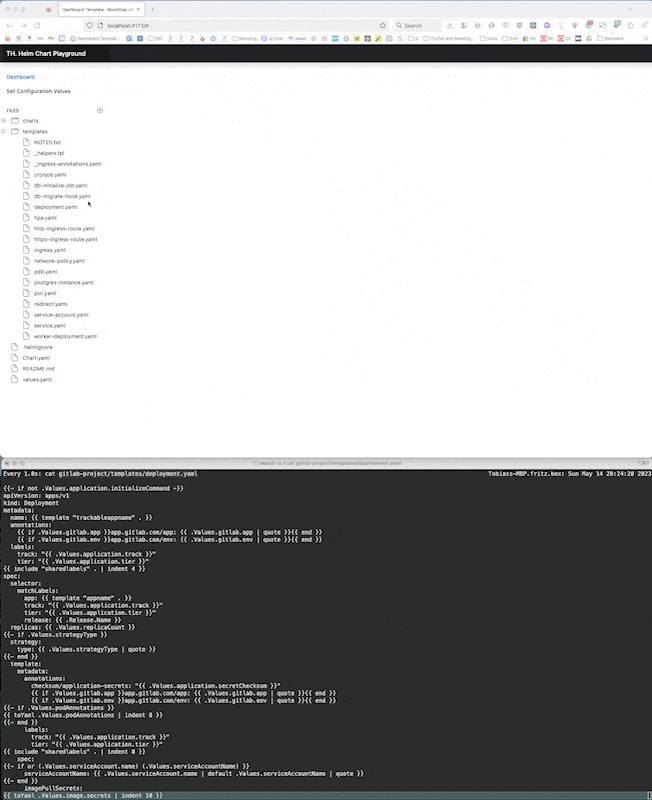

# Helm Chart Editor

I didn't like to edit Helm Charts because to understand how my YAML template file looks rendered wasn't really obvious.
I thought a split-view editor which has on the left side the template and on the right side the rendered template would help me much when I work with helm charts.

There are some similar projects like:

- [helm-playground.com](https://helm-playground.com/), [github.com/shipmight/helm-playground](https://github.com/shipmight/helm-playground)
- or [github.com/paulvollmer/helm-playground](https://github.com/paulvollmer/helm-playground)

But they had some limitations like:

- they both have the need to copy and paste the template into the editor instead of loading the chart / template from the local directory,
- they both are using a own implementation of a helm template/chart renderer written in go (compiled to a WebAssembly) which isn't exactly the same what helm does.

## Demonstration



## Setup

### Shell, `edit-chart` command

The idea behind the `edit-chart` command is to quickly start editing a chart from the command line. the `edit-chart` command (script) changes the volume mount source in the docker-compose file and restarts the container to apply the changes.

```bash
curl -sSLf https://raw.githubusercontent.com/tobiashochguertel/helm-editor-frontend/main/install.sh | bash
```

**Usage:**

```bash
cd path-to-my-chart && edit-chart && open http://localhost:4173
```

### Docker-Compose

See [docker-compose.yml](docker-compose.yml) for how to setup and configure this project.

**Example: `docker-compose.yml`**

```yaml
version: '3.5'
services:
  backend:
    image: docker.io/tobiashochguertel/th-helm-playground-backend:latest
    volumes:
      - ./../gitlab-project:/app/public
      # - /Users/tobiashochgurtel/work-dev/helm-playground/github/gitlab/charts/gitlab:/app/public
    environment:
      - PORT=3001
  template:
    image: docker.io/tobiashochguertel/th-helm-playground-template:latest
    environment:
      - PORT=3002
  webapp:
    image: docker.io/tobiashochguertel/th-helm-playground-frontend:latest
    ports:
      - '4173:80'
    environment:
      - BACKEND_PORT=3001
      - BACKEND_HOSTNAME=backend
      - BACKEND_TEMPLATE_HOSTNAME=template
      - BACKEND_TEMPLATE_PORT=3002
```

to provide a chart to the Helm Chart Playground, use the `volume` mount option of docker / podman. Above we mount a path `./../gitlab-project` into the *backend container* to path `/app/public`.

**Example for `./../gitlab-project`:**

```shell
❯ cd ./../gitlab-project
❯ tree
.
├── Chart.yaml
├── README.md
├── charts
├── templates
│   ├── NOTES.txt
│   ├── _helpers.tpl
│   ├── _ingress-annotations.yaml
│   ├── cronjob.yaml
│   ├── db-initialize-job.yaml
│   ├── db-migrate-hook.yaml
│   ├── deployment.yaml
│   ├── hpa.yaml
│   ├── http-ingress-route.yaml
│   ├── https-ingress-route.yaml
│   ├── ingress.yaml
│   ├── network-policy.yaml
│   ├── pdb.yaml
│   ├── postgres-instance.yaml
│   ├── pvc.yaml
│   ├── redirect.yaml
│   ├── service-account.yaml
│   ├── service.yaml
│   └── worker-deployment.yaml
└── values.yaml

3 directories, 22 files
```

Each change of a file in the editor is automatically written back to the file in the mounted directory, there is now Save button or similar. Also no function in the editor to create a new file. If you want to add a new file, then please use the shell or Filesystem Browser, and refresh the editor with `F5` to see the new file in the editor's file and directory list on the left side.

## Related Repositories

- [th-helm-playground-backend](https://github.com/tobiashochguertel/th-helm-playground-backend) -  Provides the Files and content for the frontend (~left side).
- [th-helm-playground-template](https://github.com/tobiashochguertel/th-helm-playground-template) - Renderer, returns the content for the right side of the editor.
